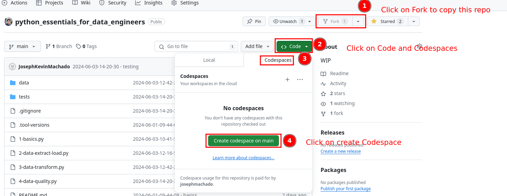
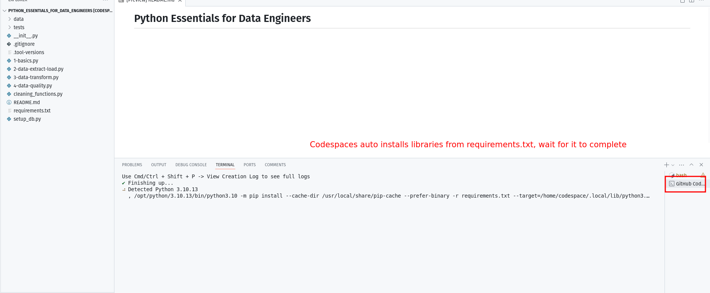
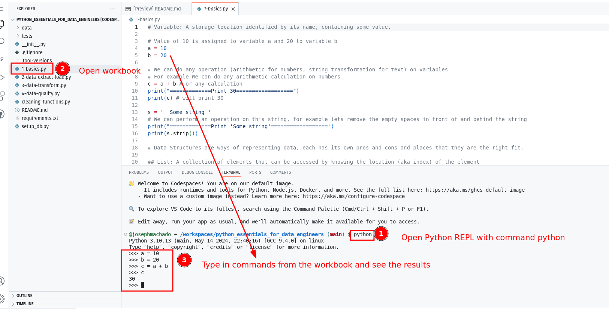

* [Python Essentials for Data Engineers](#python-essentials-for-data-engineers)
    * [Run on Codespaces](#run-on-codespaces)
    * [Running on your laptop](#running-on-your-laptop)
    * [Using python REPL](#using-python-repl)

Code for Blog at: [Python Essentials for Data Engineers](https://www.startdataengineering.com/post/python-for-de/).

# Python Essentials for Data Engineers 

## Run on Codespaces

Open codespaces and wait for codespaces to setup. The process of opening codespaces and waiting for completion is shown below.

**NOTE**: Make sure to turn off codespaces, you only have limited free usage per month.




## Running on your laptop

Clone the repo, cd into it and setup the virtual environment as shown below.

```bash
git clone https://github.com/josephmachado/python_essentials_for_data_engineers.git
cd python_essentials_for_data_engineers

python -m venv myenv
source myenv/bin/activate
pip install -r requirements.txt

# open python REPL with 
python
```

## Using python REPL



In the Python REPL you can try out the commands and do the exercises.

To run pytest (under ./tests folder) you will need to run the `python -m pytest ./tests` command.

The questions are files with the prefix `-questions.py`, use these as starting points to practice python for data engineering. While the workbooks have solutions, there are multiple ways to do the same thing, and as long as you get the correct answer, you should be good.
